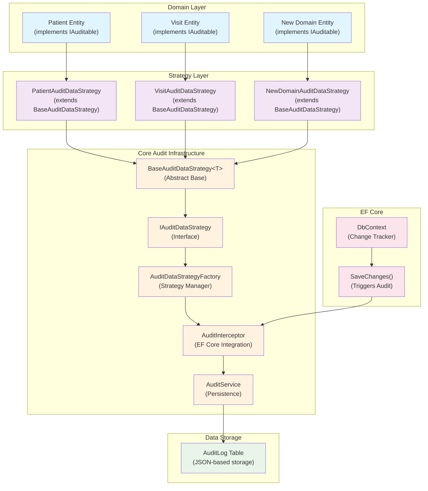

# Atlas Audit System - .NET 8

A scalable audit system demonstrating automatic change tracking with EF Core using the Strategy Pattern for domain-specific audit data construction.

## 🏗️ Architecture Overview



## 🔄 How It Works

### 1. Automatic Audit Capture
- **EF Core Integration**: `AuditInterceptor` hooks into EF Core's `SaveChanges()` lifecycle
- **Change Detection**: Automatically detects Insert, Update, Delete operations on entities implementing `IAuditable`
- **Strategy Selection**: `AuditDataStrategyFactory` selects the appropriate strategy for each entity type

### 2. Strategy Pattern Implementation
- **Domain-Specific Logic**: Each domain implements its own `AuditDataStrategy` extending `BaseAuditDataStrategy<T>`
- **Flexible Data Extraction**: Strategies define which fields to audit and how to extract entity IDs
- **Centralized Management**: Factory pattern manages all registered strategies

## 🚀 Quick Start

### Run the Application
```bash
dotnet build
cd Atlas/Atlas.API
dotnet run
```

### Test Audit Functionality
```bash
# Create a patient (triggers INSERT audit)
curl -X POST "https://localhost:7001/api/patient" \
  -H "Content-Type: application/json" \
  -d '{"firstName": "John", "lastName": "Doe", "email": "john@email.com"}'

# Update the patient (triggers UPDATE audit)  
curl -X PUT "https://localhost:7001/api/patient/1" \
  -H "Content-Type: application/json" \
  -d '{"id": 1, "firstName": "John", "lastName": "Smith", "email": "john@newemail.com"}'

# View audit logs
curl -X GET "https://localhost:7001/api/audit"
```

## 🔧 Extending for New Domains

### Step 1: Create Domain Entity
```csharp
public class Order : IAuditable
{
    public int Id { get; set; }
    public string OrderNumber { get; set; }
    public decimal Amount { get; set; }
    // ... other properties
}
```

### Step 2: Implement Audit Strategy
```csharp
public class OrderAuditDataStrategy : BaseAuditDataStrategy<Order>
{
    public OrderAuditDataStrategy(ILogger<OrderAuditDataStrategy> logger) 
        : base(logger) { }

    protected override string GetTableName() => "Orders";
    
    protected override string GetEntityId(Order entity) => entity?.Id.ToString() ?? string.Empty;
    
    protected override Dictionary<string, object> ExtractValues(Order entity)
    {
        return new Dictionary<string, object>
        {
            ["Id"] = entity.Id,
            ["OrderNumber"] = entity.OrderNumber,
            ["Amount"] = entity.Amount,
            // Add fields you want to audit
        };
    }
}
```

### Step 3: Register Strategy
```csharp
// In Program.cs
builder.Services.AddScoped<IAuditDataStrategy, OrderAuditDataStrategy>();
```

## 🎯 Key Benefits

- **Zero Code Changes**: Existing CRUD operations automatically generate audit logs
- **Domain Flexibility**: Each domain controls its own audit data structure  
- **Error Resilience**: Audit failures don't break main operations
- **Scalable Architecture**: Easy to add new domains without touching core audit code
- **Performance**: Asynchronous audit processing doesn't block main operations

## 🔍 Architecture Highlights

- **Separation of Concerns**: Core audit logic separated from domain-specific logic
- **Strategy Pattern**: Pluggable audit strategies for different entity types
- **Factory Pattern**: Centralized strategy management and selection